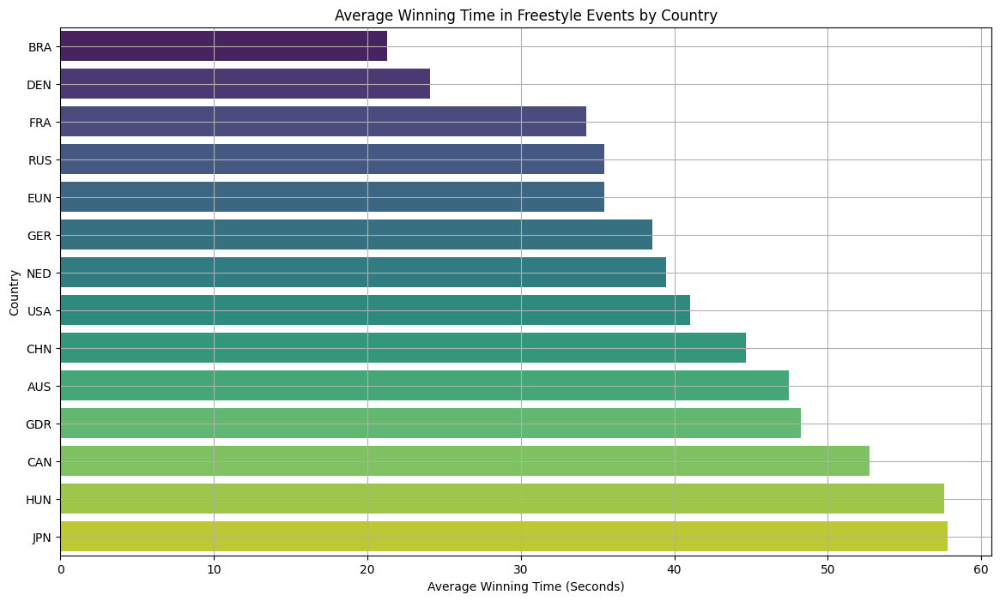

# async-blue-Kevin-Ly-final-project

## Dataset
[Olympic Swimming History (1912 to 2020)](https://www.kaggle.com/datasets/datasciencedonut/olympic-swimming-1912-to-2020)

## Why did I choose this dataset?

I chose the Olympic Swimming History from 1912 to 2020 because I wanted to analyze how swimming has changed, and how fast the human pinnacle of swimming is. I have a passion for swimming and swam a lot as a kid, so I am especially curious to see the speed of each athlete.

## Progress
- [x] Picked dataset
- [x] Defined 10 questions
- [x] Answered 10 questions using Pandas
- [x] Added at least one data visualization (using Matplotlib and/or Seaborn) to each single question
- [x] Prepared presentation slides to present at graduation

## Questions
- [x] Question 1: Who has won the most gold medals?
  - Answer: The athlete with the most gold medals is Michael Phelps with 13 gold medals.
  - Visualization: 

- [x] Question 2:  What are the world record times for each swimming event?
  - Answer: They range from 1 minute to 8 minutes depending on the length of the event.
  - Visualization: 

- [x] Question 3: How have the winning times for freestyle events changed over the years?
  - Answer: The winning times have consistently gotten faster over the years.
  - Visualization:

- [x] Question 4: How does the average medal time differ between men and women in butterfly events?
  - Answer: The men's times are roughly 2 seconds faster than the women's times.
  - Visualization:

- [x] Question 5: Which country has won the most gold medals in swimming across all years?
  - Answer: USA has the most gold medals in swimming across all years with 240 gold medals, followed by Australia with 61 gold medals.
  - Visualization:

- [x] Question 6: How has participation in relays versus individual events changed over time for each gender?
  - Answer: Significantly more people have participated in individual events versus relay events.
  - Visualization:

- [x] Question 7: What is the average time for each swimming stroke type in the latest Olympics?
  - Answer: For backstroke, 55.435 seconds. For breastroke, 58.605 seconds. For Butterfly, 53.393 seconds.
  - Visualization:

- [x] Question 8: Which swimming stroke has shown the most improvement in winning times over the decades?
  - Answer: Freestyle has shown the most improvement in winning times.
  - Visualization:

- [x] Question 9: Which Olympic year had the highest number of participating countries in swimming events?
  - Answer: The Olympic year with the highest number of participating countries in swimming events is 2004 with 36 countries.
  - Visualization:

- [x] Question 10: Which country has the fastest average winning time in freestyle events?
  - Answer: The country with the fastest average winning time in freestyle events is Brazil with an average time of 21.30 seconds.
  - Visualization: